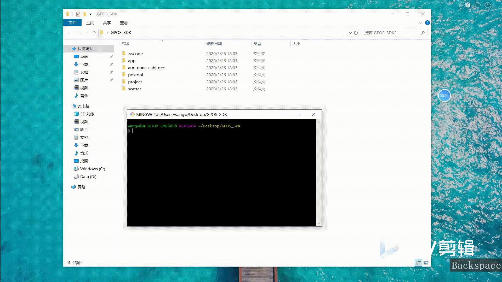
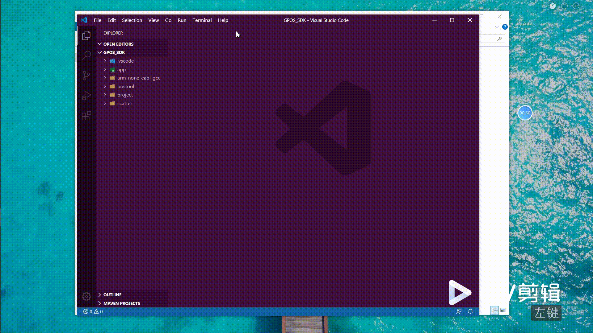
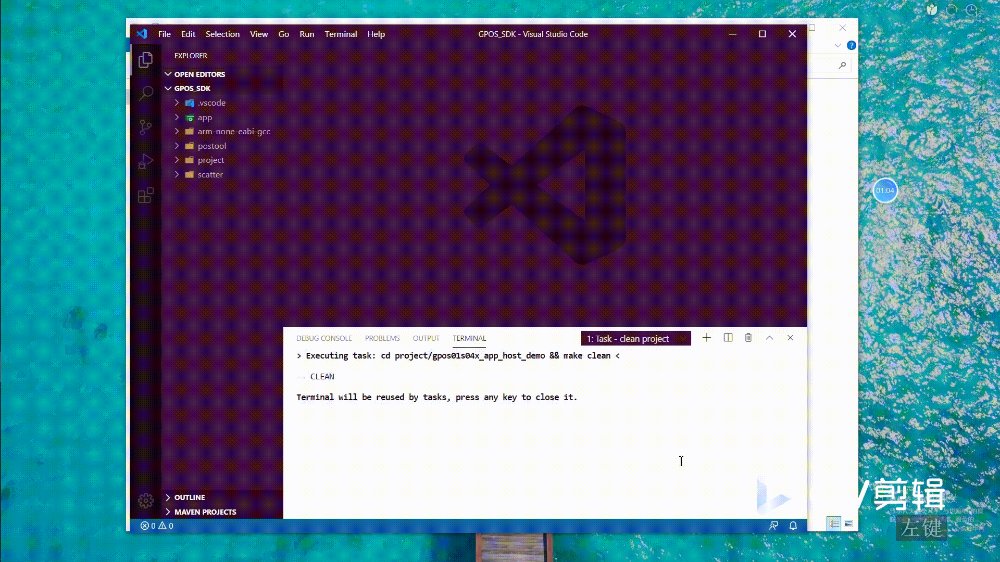

# GNU Arm embedded toolchain for Windows 

The GNU Embedded Toolchain for Arm is a ready-to-use, open source suite of tools
for C, C++ and Assembly programming targeting Arm Cortex-M and Cortex-R family 
of processors. It includes the GNU Compiler (GCC) and is available free of 
charge directly from Arm for embedded software development on Windows, Linux and
macOS operating systems.

<div>


</div>

This repository is the original Windows version of the GNU Compiler from Arm 
packaged for Visual Studio Code:

[GNU Arm embedded toolchain](https://developer.arm.com/open-source/gnu-toolchain/gnu-rm/downloads)

## Build Task Script
In Visual Studio Code goto extensions (Shift+Ctrl+X), search for '*dspread-mpos-compiler*' 
and install the extension that is suited for your operating system. 

The extension has four paths for the toolchain. You can use this in the 
tasks.json.

- arm-none-eabi.bin
- arm-none-eabi.include
- arm-none-eabi.lib
- arm-none-eabi.libgcc
- git.bash

Here is an build example of tasks.json for GNU make. '&&'connect multiple commands
```javascript
{
  "version": "2.0.0",
  "tasks": [
    {
      "label": "build firmware",
      "type": "shell",
      "command": "cd project/gpos01s04x_app_host_demo&&make clean&&make -j4 ",
      ...
    }
  ]
}
```

# IDE Setup

## Prequisite
* install `vscode`  ([https://code.visualstudio.com/download](https://code.visualstudio.com/download))

## Download SDK

``` bash
$ git clone https://gitlab.com/dspread/GD001.git
$ cd GD001

```

## Compile demo project ([dev-setup-guide.gif](images/dev-setup-guide.gif))

### 1.install `vscode-icon`([vscode-icon](images/install-vscode-icon.gif)) extension to keep project organized
* File > Preferences > File Icon Theme > VSCode Icons.


### 2.run [task: clean project](images/run-clean-task.gif). 
* Terminal->run task->clean project
* Enable the `shell terminal` environment for embeded toolchain execution as below video



### 3.run [task: build firmware](images/run-build-task.gif)
* Terminal->run task->build firmware



## Download firmwre
* Install [USB driver](../../FAQs_Document/-/tree/master/tools/pos drive.zip)
* Connect device to PC with USB cable   
* run posupgrader.exe to load the compiled `hex` file to device

## Release Notes

### Version 0.1.6
Version 4-2011-q4-major for Windows  
Released: December 20, 2011
